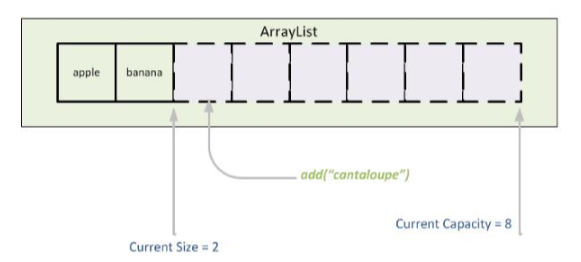
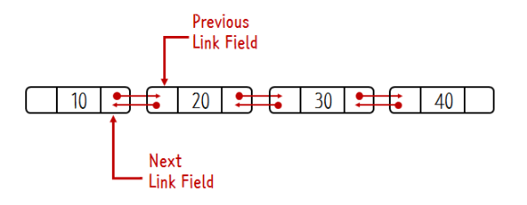
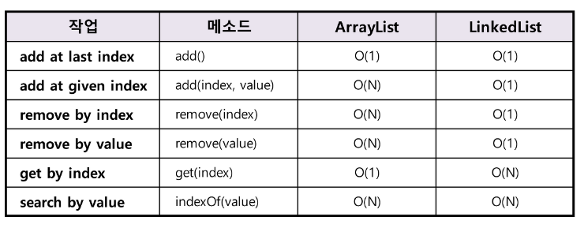

# 배열 개념 정리

## 배열(Array)란?
배열은 크기를 지정하고 해당 크기 만큼의 **연속된 메모리 공간**을 할당받아 작업을 수행하는 자료형을 의마한다.

### 배열의 특징
- 인덱스를 사용하여 값에 바로 접근 가능
- 새로운 값을 삽입하거나 특정 인덱스에 있는 값을 삭제하기 어렵다. Why? 값을 삽입하거나 삭제하려면 해당 인덱스 주변에 있는 값을 과정을 수행해야한다.
- 배열의 크기를 선언할 때 지정해야하며, 한 번 선언하면 크기를 늘러거나 줄일 수 없다.

## 리스트(List)란?
리스트는 값과 포인터(이동 주소)를 묶은 노드라는 것을 가지고 한 줄로 연결되어 있는 방식의 자료구조이다.

### 리스트의 특징
- 인덱스가 없으므로 값에 접근하려면 Head 포인터부터 순서대로 접근해야한다.
- 데이터의 물리적인 순서와 상관없이 포인터를 사용하여 논리적인 순서대로 연결하는 구조이다.
- 크기 변경이 유연하고, 효율적인 메모리 사용

## ArrayList API

ArrayList는 중복을 허용하고 순서를 유지하며 인덱스로 원소들을 관리한다는 점에서 배열과 유사하다. 
여기서 추가로 동적으로 요소를 추가, 삭제 가능하고 **용량이 초과시** 용량의 크기를 키운다. 
Java ArrayList API는 용량이 가득 차면 1.5배씩 크기를 늘린다.

## LinkedList API

LinkedList는 중복을 허용하고 값과 포인터를 노드로 관리하는 점에서 리스트와 유사하고 
내부적으로 `양방향의 연결 리스트`로 구현되어 있다.

## ArrayList와 LinkedList 차이

| 컬렉션   | 탐색  | 추가/삭제 | 비 고                                                      |
|-------|-----|-------|----------------------------------------------------------|
| ArrayList | 빠르다 | 느리다   | 순차적인 추가/삭제는 ArrayList가 더 빠름 **정렬**이 잦아도 ArrayList 사용 |
| LinkedList | 느리다 | 빠르다   | 데이터가 많을수록 별로다.                                           |

### ArrayList vs LinkedList 시간복잡도
